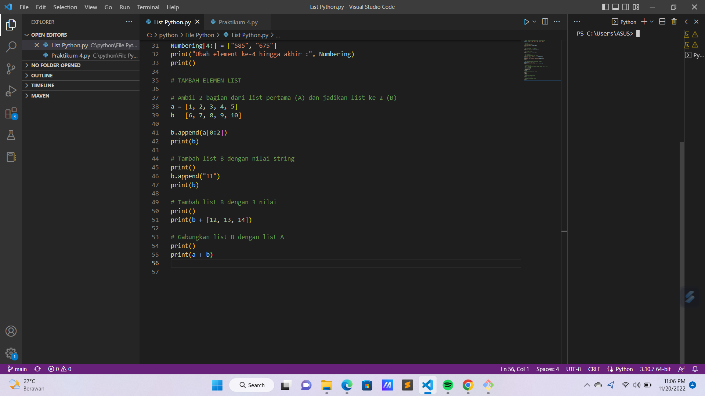

# Praktikum-5
**PERTEMUAN KE 9**

**Latihan**

Buat sebuah list sebanyak 5 elemen dengan nilai bebas

**Akses list:**
- Tampilkan elemen ke 3
- Ambil nilai elemen ke 2 sampai elemen ke 4
- Ambil elemen terakhir

**Ubah elemen list:**
- Ubah elemen ke 4 dengan nilai lainnya
- Ubah elemen ke 4 sampai dengan elemen terakhir
 
**Tambah elemen list:**
- Ambil 2 bagian dari list pertama (A) dan jadikan list ke 2 (B)
- Tambah list B dengan nilai string
- Tambah list B dengan 3 nilai
- Gabungkan list B

Silahkan Tulis Kode Program Seperti Berikut : 

Maka Output nya Akan Seperti Ini :

**MODUL PRAKTIKUM 4**

**TUGAS PRAKTIKUM**

**Buat program sederhana untuk menambahkan data kedalam sebuah list dengan rincian sebagai berikut:**
- Progam meminta memasukkan data sebanyak-banyaknya (gunakan perulangan)
- Tampilkan pertanyaan untuk menambah data (y/t?), apabila jawaban t (Tidak), maka program akan menampilkan daftar datanya.
- Nilai Akhir diambil dari perhitungan 3 komponen nilai (tugas: 30%, uts: 35%, uas: 35%)
- Buat flowchart dan penjelasan programnya pada README.md.
- Commit dan push repository.

Silahkan Tulis Kode Program Seperti Berikut : 

Maka Output nya Akan Seperti Ini :

**GAMBAR FLOWCHART**

